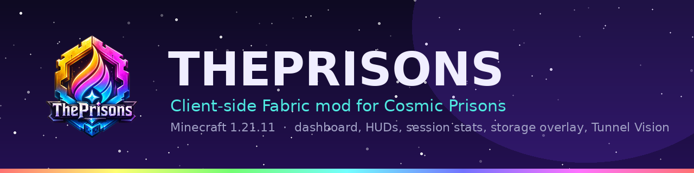
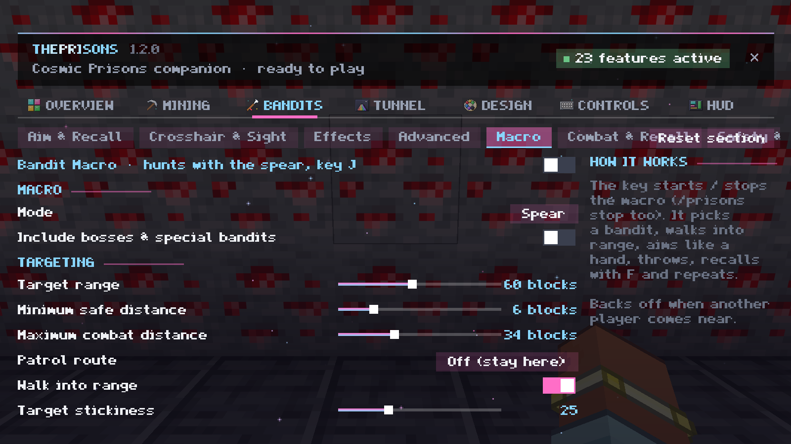

  

# ThePrisons

[English](README.md) · **Deutsch**

Eine **clientseitige Fabric-Mod** für Minecraft `1.21.11` und den **Cosmic-Prisons**-Server: ein Design-orientiertes Dashboard, HUD-Widgets mit Live-Session-Stats, eine Lager-Übersicht, Spieler-Werkzeuge, Tunnel Vision und als optionale Extras eine Mining-Automatik mit eingebautem Pathfinder und Banditen-Helfer.

- **[Website](https://olb-freelocs.github.io/ThePrisons/)** · [Funktionen](#funktionen) · [Installation](#installation) · [Befehle](#befehle) · [FAQ](#faq) · [Haftungsausschluss](#haftungsausschluss) · [Changelog (Deutsch)](CHANGELOG.de.md)

> **Neu in 1.2.0 - das Bandit-Makro ist in Arbeit (erst zu etwa 2 % fertig).** Es ist im Release, damit ihr seht, wohin die Reise geht. Rechnet mit Ecken und Kanten, das meiste ist auf dem Server noch ungetestet, und lasst es nicht unbeaufsichtigt laufen.

## Funktionen

### Dashboard
Öffnet sich mit `/prisons`, den Tasten (`I`, oder rechte Shift-Taste für das Modmenü) oder Mod Menu. Animierte Seiten: **Overview**, **Mining**, **Bandits**, **Tunnel**, **Design**, **Controls** und **HUD**. Jede Einstellung hat Schalter, Regler, Auswahl, Farbpalette oder Textfeld und einen Tooltip. Themes, Kartendunkelheit, Animationen, eine kantige Schrift und Comic-Texturen gibt es unter **Design**.

### Erz-Makro und Mining-Werkzeuge
- Eigener **Pathfinder** mit Tunnel-Zentrierung, geplanten Routen (Weltgedächtnis), Routen-Erinnerung, Anti-Stuck und Kampf-Sicherung
- **Wächter-Zonen-Logik**: bleibt im bewachten Bereich, schaut voraus, rennt zu einem Wächter zurück, passt sich Spielern in der Nähe an
- **Pausen** bei einem Warden, **menschliche Blickbewegung** (Frame-genaue Rotation, kein Springen)
- **Verfolger-Schutz**: wer ständig folgt, bekommt eine höfliche `/msg`, danach geht das Makro weit weg (`/spawn` und zurück); bekannte Killer werden gemieden; Befehls-Abklingzeiten werden abgewartet
- **Item-Sortierer**: Fahrten zum Spawn und zu den privaten Lagern (Shards, Contraband, Energie, Geld), Pet- und Fähigkeits-Nutzung, Tod-Wiederherstellung
- **Wegpunkt-Editor und Routen-Rekorder**, Grenzmarkierungen
- Taste `K` schaltet das Makro; `/prisons stop` stoppt es

### Markt (noch nicht verfügbar)
Das Markt-Modul (eigene Auktionshaus- und `/ee`-Bildschirme, Shop-Overlays, Item List, Preis-Scan) ist in Release-Builds **abgeschaltet**, bis es überprüft ist. Der Code bleibt im Repository und läuft nur im Entwickler-Build.

### HUD
Scoreboard (ersetzt die Server-Sidebar), **Better Tab**, **Session-HUD** (Ore-Mining- und Bandit-Modus, Laufzeit, Erze pro Sekunde, Steuer, Booster, Level-Up-Prognose, live **Energy/h und XP/h** aus der Action Bar mit dem Durchschnitt darunter), Pets und Trinkets, Befehls-Abklingzeiten, Satchels, Rüstungshaltbarkeit, Item-Einblicke und Benachrichtigungen als Karten. Ein **HUD-Editor** verschiebt und skaliert jedes Widget.

### Lager-Übersicht
`/pv` öffnet alle privaten Lager als Karten; geöffnete Seiten bleiben voll benutzbar.

### Spieler
Freunde und Gang-Färbung (`/prisons friend ...`), **Sneak Trade** (Sneak + Rechtsklick auf einen Spieler sendet `/trade`), **Spielerkarten** (Rechtsklick auf einen Spieler, `Shift + Tab` für die Spielerliste).

### Banditen
- **Speer-Helfer**: statisches Schützen-Fadenkreuz, Zielpunkt mit Vorhalt und Fall, Wurf- und Rückkehr-Effekte
- **Zielhilfe (Taste `L`)**: die Mod schaut auf die beste Linie von Banditen (Banditen sind die Spieler `bandit_xx_xxxxxx`), mit der menschlichen Blickbewegung des Erz-Makros
- **Bandit-Makro (Taste `J`, in Arbeit, ~2 %)**: ein Zustandsautomat, der einen Banditen sucht, zielt, auflädt, wirft und den Speer zurückruft, mit Gefahrencheck, Patrouillen-Route und eigenen Unter-Tabs im Dashboard. Unfertig und größtenteils auf dem Server ungetestet
- **Rückruf-Timing**: zeigt den besten Moment für `F` - du drückst

### Tunnel Vision (`F5` + `V`)
Die Spielansicht wird durch einen Hintergrund deiner Wahl ersetzt, nur dein Spieler bleibt als 3D-Modell auf einer Regenbogenstraße, die dem Makro folgt. Zwei Animationen (Regenbogenstraße und fliegender Teppich), abschießbare Ziele und eine Leistungs-Einstellung. Eigene Bilder in `config/theprisons/tunnel/`.

### Komfort
Nachrichten-Benachrichtigungen, friedliches Mining, Vitalwarnungen, Bereit-Ansagen, ein Abklingzeiten-Cache und ein Update-Check (GitHub-Releases). Item- und Rüstungstexturen im Comic-Look (nichts von Mojangs Grafik wird mitgeliefert).

## Installation
1. Installiere den [Fabric Loader](https://fabricmc.net/use/) `0.17.3` oder neuer für Minecraft `1.21.11` und Java 21.
2. Lege die [Fabric API](https://modrinth.com/mod/fabric-api) in deinen `mods`-Ordner ([Mod Menu](https://modrinth.com/mod/modmenu) ist optional).
3. Lade die Jar vom [neuesten Release](https://github.com/olb-freelocs/ThePrisons/releases/latest) und lege sie in `mods`. Der Dateiname sagt alles: `ThePrisons-<Codename>-v<Version>-mc<Minecraft>.jar`, z. B. `ThePrisons-Nebula-v1.2.0-mc1.21.11.jar`.
4. Starte das Spiel und tritt dem Server bei; `/prisons` öffnet das Dashboard.

## Befehle
`/prisons` (Alias `/theprisons`): `gui`, `toggle <modul>`, `stop`, `stats`, `reset`, `perf`, `sprint`, `routes`, `set border`, `friend add|remove|list <name>`, `lang [de|en]`. Die ausführliche Tabelle steht in der [englischen README](README.md#commands).

## FAQ
**Ist es auf Cosmic Prisons erlaubt?** Lies die Serverregeln selbst. Siehe [Haftungsausschluss](#haftungsausschluss).

**Ist das Bandit-Makro fertig?** Nein, etwa 2 %. Siehe den Hinweis oben.

**Läuft es im Einzelspieler oder auf anderen Servern?** Es ist für Cosmic Prisons gebaut; viele Funktionen lesen Menüs, Chat und Sidebar dieses Servers.

## Haftungsausschluss
ThePrisons ist ein inoffizielles Fan-Projekt, **nicht verbunden mit Mojang, Microsoft oder dem Cosmic-Prisons-Server**. Automatisierung und Zielhilfen (Erz-Makro, Bandit-Makro, Speer-Helfer, Rückruf-Helfer) können **gegen die Regeln eines Servers verstoßen und zu Strafen oder Sperren führen**. Du nutzt die Mod auf eigenes Risiko; die Autoren haften nicht für Folgen für deinen Account. Der Code ist **All Rights Reserved** (siehe [LICENSE](LICENSE)).
