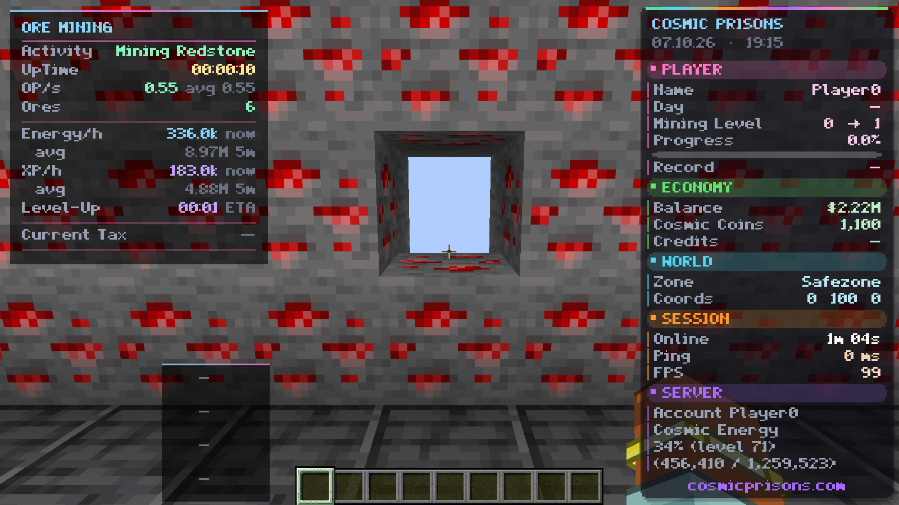

  

  
  
  
  
  

# ThePrisons

**English** · [Deutsch](README.de.md)

A **client-side Fabric mod** for Minecraft `1.21.11` and the **Cosmic Prisons** server: a design-first dashboard, HUD widgets with live session stats, a storage overlay, player tools, Tunnel Vision and, as optional extras, a mining automation with a built-in pathfinder and bandit helpers.

- **[Website](https://noxtryn.github.io/ThePrisons/)** · [Features](#features) · [Installation](#installation) · [Configuration](#configuration) · [Commands](#commands) · [FAQ](#faq) · [Disclaimer](#disclaimer) · [Changelog](CHANGELOG.md)

> **New in 1.2.0 - the Bandit Macro is a work in progress (about 2 % done).** It is in the release so you can see where it is going. Expect rough edges, most of it is untested on the server, and do not leave it running unattended.

> The mod ships a fixed feature set (`FeatureProfile`): users change the design, the HUD layout, keybinds and the settings of each feature - features themselves are not switched on and off. The Ore Macro, the waypoint editor and the Spear Helper are the user-configurable exceptions.

## Features

### Dashboard
Opens with `/prisons`, the keybinds (`I`, or right shift for the module menu) or Mod Menu. Animated pages: **Overview**, **Mining**, **Bandits**, **Tunnel**, **Design**, **Controls** and **HUD**. Every setting has a switch, slider, choice button, colour palette or text field, a tooltip, and each section can be reset. Themes, card darkness, animations, a boxy font and comic textures are in **Design**.

<!-- SCREENSHOT: docs/media/dashboard.webp - re-record without the disabled "Market Prices" tile (see docs/raw/BENÖTIGT.md) -->

### Ore Macro and mining tools
- Own **pathfinder** with tunnel centring, planned routes (world memory), route memory, anti-stuck and a combat failsafe
- **Guarded-zone logic**: stays in the guarded area, looks ahead, runs back to a guard, adapts to nearby players
- **Breaks** at a warden, **human view motion** (frame-rate rotation, no snapping)
- **Follower protection**: somebody who keeps following gets a polite `/msg`, then the macro goes far away (`/spawn` and back); known killers are avoided; command cooldowns are waited out
- **Item sorter**: trips to spawn and the private vaults (shards, contrabands, energy, money), pet and ability use, death recovery
- **Waypoint editor and route recorder**, border marks
- Key `K` toggles the macro; `/prisons stop` stops it

<!-- SCREENSHOT: docs/media/item-sorter.webp - the item sorter trip (see docs/raw/BENÖTIGT.md) -->
<!-- SCREENSHOT: docs/media/guard-zones.webp - guard zone and border marks (see docs/raw/BENÖTIGT.md) -->

### Market (not available yet)
The AH/EE market views and Item List are included in the **v1.3.0-beta.1 public beta**. Their server-specific behavior has not been fully validated on Cosmic Prisons; market observations can be stale or incomplete and are not trading guarantees. Shop overlays and other market surfaces may have separate limitations described in the release notes.

### HUD
Scoreboard (replaces the server sidebar), **Better Tab**, **Session HUD** (Ore Mining and Bandit modes, uptime, ores per second, tax, boosters, level-up ETA, live **Energy/h and XP/h** from the action bar with the average below), pets and trinkets, command cooldowns, satchels, armour durability, item insights and notifications as sliding cards. A **HUD editor** moves and scales every widget (drag, scroll, snapping).

### Storage overlay
`/pv` opens all private vaults as cards; open pages stay fully usable, inventory and hotbar below.

### Players
Friends and gang colouring (`/prisons friend ...`), **Sneak Trade** (sneak + right-click a player sends `/trade`), **Player Cards** (right-click a player, `Shift + Tab` for the player list).

### Bandits
- **Spear Helper**: static shooter crosshair (presets), sight point with lead and drop for enemy players, throw and return effects
- **Aim assist (key `L`)**: the mod looks at the best line of bandits (bandits are the players named `bandit_xx_xxxxxx`), with the Ore Macro's human view motion; the mouse is locked while it aims, movement stays yours
- **Bandit Macro (key `J`, work in progress, ~2 %)**: a state machine that seeks a bandit, aims, charges, throws and recalls the spear, with a danger check, patrol route and its own dashboard sub-tabs. Unfinished and mostly untested on the server
- **Recall timing**: shows the best moment to press `F` within the deadline - you press

### Tunnel Vision (`F5` + `V`)
The game view is replaced by a backdrop of your choice, with only your player as a 3D model on a rainbow road that follows what the macro does. HUDs stay. Iris transition, notifications and a stats ticker. Two animations that switch in turns (or pick one): the **rainbow road** and a **magic carpet** that floats up and down while its left and right stay fixed to your character - the road dissolves into particles and the carpet appears. Pink crystals (road) and light-blue asteroids (carpet) appear ahead; you shoot them and they burst. A performance setting trades particles and road detail for FPS. Put your own pictures into `config/theprisons/tunnel/`.

### Quality of life
Message notifications, peaceful mining, vitals warnings, ready announcements, a cooldown cache and an update checker (GitHub releases). Item and armour textures in a comic look (nothing of Mojang's art is shipped).

## Installation
1. Install [Fabric Loader](https://fabricmc.net/use/) `0.17.3` or newer for Minecraft `1.21.11` and Java 21.
2. Put [Fabric API](https://modrinth.com/mod/fabric-api) into your `mods` folder ([Mod Menu](https://modrinth.com/mod/modmenu) is optional).
3. Download the jar from the [latest release](https://github.com/Noxtryn/ThePrisons/releases/latest) and put it into `mods`. The file name tells you everything: `ThePrisons-<Codename>-v<version>-mc<Minecraft>.jar`, e.g. `ThePrisons-Nebula-v1.1.0-mc1.21.11.jar` (the codename is the release line, the version is SemVer, the Minecraft version is the one it was built for).
4. Start the game and join the server; `/prisons` opens the dashboard.

## Configuration
Everything is in the dashboard (`/prisons`). Files live in `config/theprisons/` (settings, routes, guards, friends, tunnel backdrops). Keybinds are in the dashboard's **Controls** page and in Minecraft's controls screen.

## Commands
`/prisons` (alias `/theprisons`):

| Command | What it does |
| --- | --- |
| `/prisons` or `/prisons gui` | open the dashboard |
| `/prisons toggle <module>` / `stop` | switch a module / stop the running macro |
| `/prisons stats`, `reset`, `perf` | session stats, reset the profiler, profiler report |
| `/prisons sprint [on\|off]` | auto sprint of the Ore Macro |
| `/prisons routes`, `route delete <name>` | list and delete saved routes (recording: the route keybinds) |
| `/prisons set border`, `remove border`, `borders`, `clear borders` | border marks |
| `/prisons friend add\|remove\|list <name>` | friends list |
| `/prisons lang [de\|en]` | interface language |

## FAQ
**Is it allowed on Cosmic Prisons?** Read the server rules yourself. See the [disclaimer](#disclaimer).

**Is the Bandit Macro ready?** No, about 2 %. See the note at the top.

**Where do I put backdrops for Tunnel Vision?** Into `config/theprisons/tunnel/` (png or jpg), then pick them in the dashboard's **Tunnel** page.

**Does it work in singleplayer or on other servers?** It is built for Cosmic Prisons; many features read that server's menus, chat and sidebar.

## Disclaimer
ThePrisons is an unofficial fan project, **not affiliated with Mojang, Microsoft or the Cosmic Prisons server**. Automation and aim assistance (Ore Macro, Spear Helper aim assist, recall helpers) can **violate the rules of a server and lead to sanctions or bans**. You use the mod at your own risk; the authors are not liable for any consequence for your account. The code is **All Rights Reserved** (see [LICENSE](LICENSE)).

Full history: [CHANGELOG.md](CHANGELOG.md) · [Changelog (Deutsch)](CHANGELOG.de.md).
